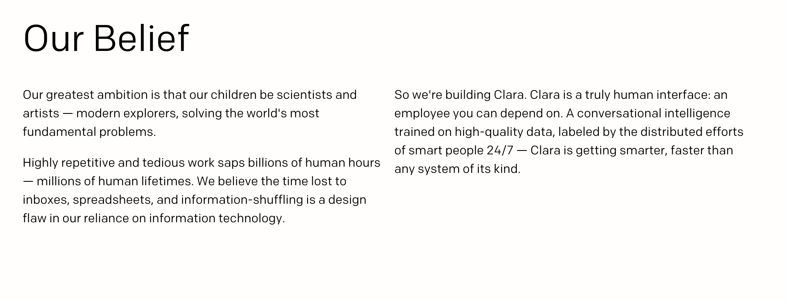

There is a new paradigm for how we interact with technology that will replace (or at least supplement) internet and mobile device browsing : intelligent assistants. Intelligent machines that recognize your voice, with whom you can speak or send messages. They will be able to learn your preferences, feed you information, play you music, send you reminders, book dinner and travel reservations, and more.

<h2>A Random Assortment of Virtual Assistants</h2>
  
  
  
  
  

<h2>A Mission Statement</h2>
  