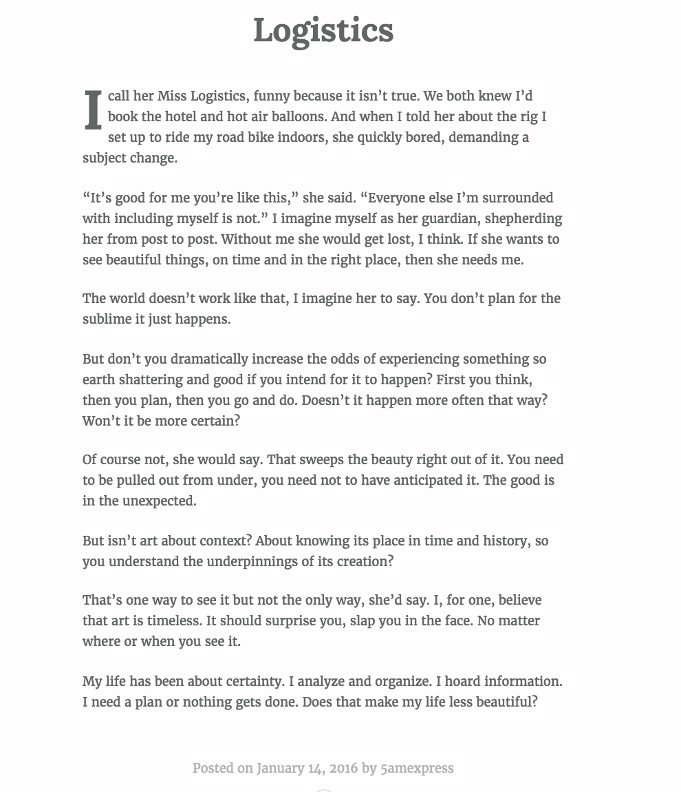

<aside>A warning: this story does not have a happy ending. Not that the data cares. Or for that matter even knows.</aside>

<h2>Before</h2>
<h3>Testing</h3>

A lifelong athlete and fitness fiend, there is a record of my fitness-related data that long predates the data Fitbit has recorded.

But Fitbit captured more data that my pen and notebook technique ever could, and did it constantly. Every minute, for every day I was wearing it. And not just my workout numbers and progress; Fitbit captured all my waking hours spent, all that time just living my life. It recorded my steps, my heart rate, the stairs I climbed and calories I burned. More than that, it captured all of my time spent asleep. Fitbit could tell me how long I slept each night, and how much of that time was in 'restless' or 'deep' sleep. Over time, this data painted a picture of my sleep habits and tendencies, how much time I spent asleep relative to how much time I spend in bed.

I already know how to keep track of workouts. I know how that I'll typically take X more steps in a day if I run to the beach than if I workout at the gym, for example. Or that I'll burn 2,700 calories with a day of average activity. Fitbit takes on an assistive role for me in my already-obsessive workout data recording. But where it really shines--where it serves me most substantially-- is in the sleep data it provides. Here it describesa world I know much less about; by definition I'm unconscious for it, after all. It tells me a story about myself I didn't at first realize could be told.

Then, I learned how to code, and I wanted to put my new skills to work to analyze a years' worth of my own Fitbit sleep data. I did a full analysis of that data <a href="#">here</a>. But here, I'm taking a closer look at a six month period, October 2015 through April 2016, because it was a particularly intense, interesting, and tumultuous time of my life. In this time I met and fell in love with L, and then, almost as quickly as it started, we broke up and I moved from New York City all the way across the country, to San Francisco.

We're increasingly worried about our privacy, as we become more and more connected and cede more control of our data to big tech companies like Google, who relentlessly collect information on our every movement, purchase, web search, and email draft, etc. If this project tells you anything it's that we are more than the data; there is a story behind the CSVs and it is not something they could ever know (unless you're like me and foolishly overshare on the interwebs through your own personal anecdotes and admissions).

<h2>This Is Supposed to Make You Feel</h2>
<ul>
  <li>Like you have some control</li>
  <li>Like they know a lot, but they don't know everything</li>
  <li>Like there's a story behind the numbers, and though the numbers could look the same for everyone, the story never does.</li>
 </ul>

<h2>A Week Off Fitbit</h2>

<h2>October, 2015</h2>

<h2>Filling the Gaps</h2>

<h2>A Dataless Night</h2>
  
  On New Year's Eve, we watched fireworks from the rooftop of a friend's apartment in the Lower East Side. The city was on fire, we watched it alight from every angle. I wasn't wearing my Fitbit that night; it didn't look right with my outfit and fresh haircut. I remember L's face as she came into my apartment as I finished readying for the night. Her eyes lit up when she saw my shorter hair.

  "You look," she said. Her eyes were matching mine. "So good."

  I felt good too. I felt warm and safe and strong, and like I was radiating all that warmth and safety and strength back to L. No amount of health and fitness data could ever capture that.

  Later that night on the rooftop, L told me she loved me. I wasn't wearing my Fitbit but it didn't matter. My guess is I slept three hours that night, body wrapped around L's. We were happy, and I don't have the data to prove it.

<h2>Words for Numbers</h2>

 One and a half weeks later, I wrote this blog post: 

 

 Four days after that, amidst L's and my plans to travel to Turkey together, I wrote another: 

 

Those blog posts, written four days apart, were the only two I published over the course of our relationship. In a way, though, they're more powerful than every single piece of data, all X nights, X minutes slept, X steps taken, X calories burned. They tell you more about my state of mind, L's personality, the intensity of it all, than the numbers ever could.

<h2>A Change in Heart</h2>

<h2>The Decision</h2>

<h2>A Move Across Country</h2>

<h2>The End</h2>

<h2>For Now</h2>

