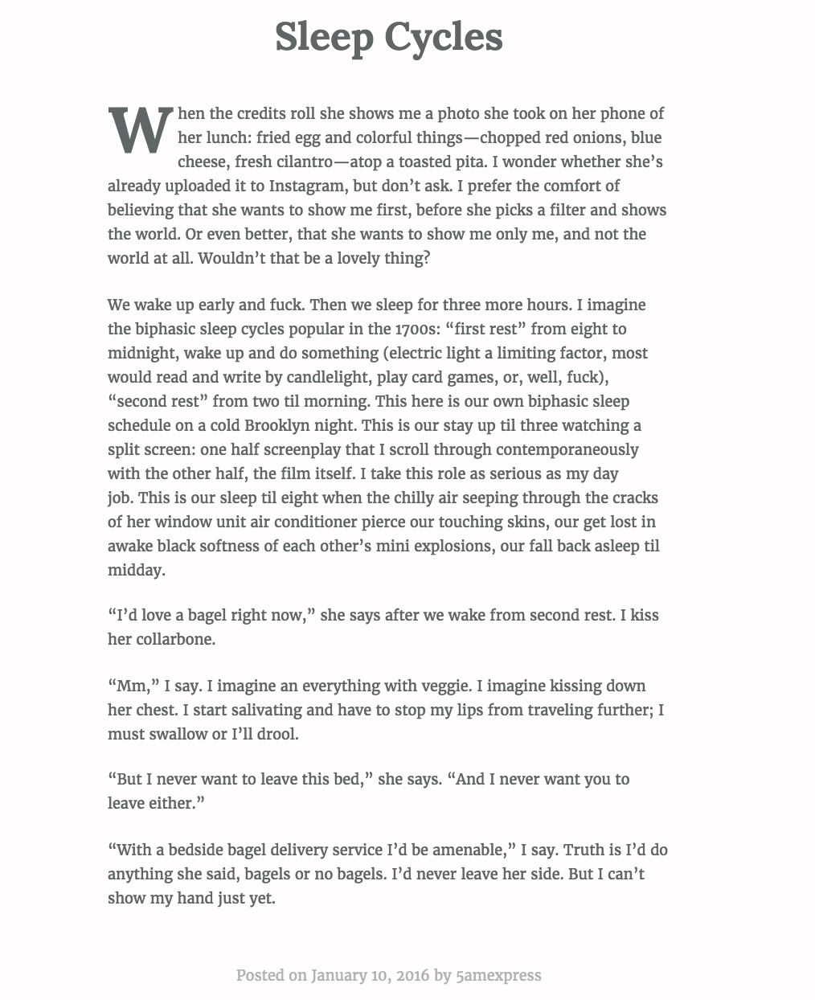

<h1>Data A Love Story</h1>
<aside>A warning: this story does not have a happy ending. Not that the data cares. Or for that matter even knows.</aside>

<h2>Before</h2>
  A lifelong athlete and fitness fiend, a record of health and fitness-related data on myself long predates my Fitbit. 

  But Fitbit captured more data that my pen and notebook technique ever could, and did it constantly. Every minute, for every day I was wearing it. And not just my workout numbers and progress; Fitbit captured all my waking hours spent just living life. More than that, it even captured my hours asleep. It could tell me how long I slept each night, how much of that time was in 'restless' or 'deep' sleep. And over time it painted a picture of my sleep habits and tendencies. 

  I already know how to keep track of workouts. I know how that I'll typically take X more steps in a day if I run to the beach than if I workout at the gym. Fitbit assists me in my already-obsessive workout data recording. But where it really shines for me is in my sleep data, a world I know much less about. I'm unconscious then, after all. It told a story I didn't realize could be told. 
<h2>This Is Supposed to Make You Feel</h2>
<ul>
  <li>Like you have some control</li>
  <li>Like they know a lot, but they don't know everything</li>
  <li>Like there's a story behind the numbers, and though the numbers could look the same for everyone, the story never does.</li>
 </ul>

<h2>A Week Off Fitbit</h2>
<h2>October, 2015</h2>

<h2>Filling the Gaps</h2>

<h2>A Dataless Night</h2>
  
  On New Year's Eve, we watched fireworks from the rooftop of a friend's apartment in the Lower East Side. The city was on fire, we watched it alight from every angle. I wasn't wearing my Fitbit that night; it didn't look right with my outfit and fresh haircut. I remember L's face as she came into my apartment as I finished readying for the night. Her eyes lit up when she saw my shorter hair.

  "You look," she said. Her eyes were matching mine. "So good."

  I felt good too. I felt warm and safe and strong, and like I was radiating all that warmth and safety and strength back to L. No amount of health and fitness data could ever capture that.

  Later that night on the rooftop, L told me she loved me. I wasn't wearing my Fitbit but it didn't matter. My guess is I slept three hours that night, body wrapped around L's. We were happy, and I don't have the data to prove it.

	<h2>Words for Numbers</h2>
  One and a half weeks later, I wrote this blog post:

  

	Four days after that, amidst L's and my plans to travel to Turkey together, I wrote another:
	
  

  Those blog posts, written four days apart, were the only two I published over the course of our relationship. In a way, though, they're more powerful than every single piece of data, all X nights, X minutes slept, X steps taken, X calories burned. They tell you more about my state of mind, L's personality, the intensity of it all, than the numbers ever could.

<h2>A Change in Heart</h2>

<h2>The Decision</h2>

<h2>A Move Across Country</h2>

<h2>The End</h2>

<h2>For Now</h2>

